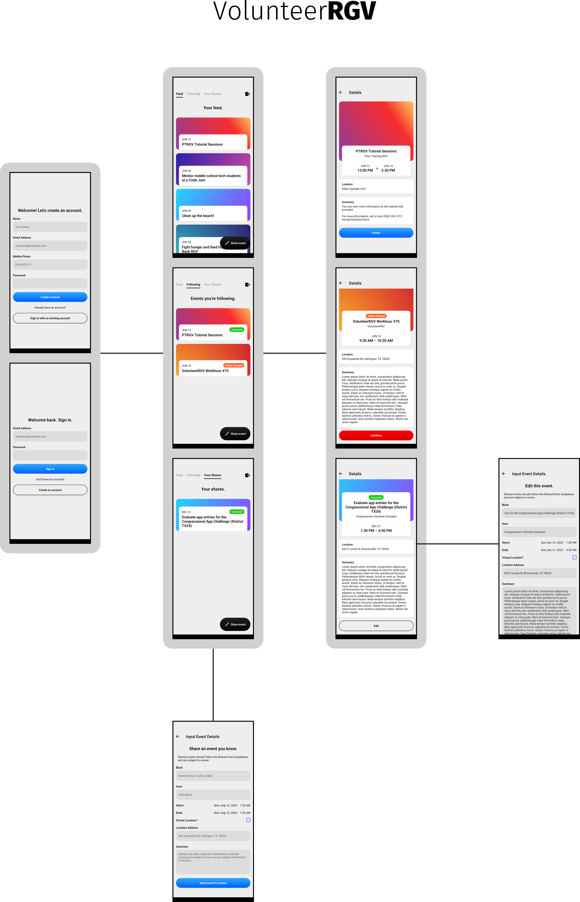

# VolunteerRGV

**VolunteerRGV** is a cross-platform mobile app for iOS and Android where anyone can find and share service opportunities to others in the Rio Grande Valley region, or RGV, of south Texas.

**Time spent:** 280 hours

**Technologies used:**
- React Native (with Expo framework)
- Firebase (Authentication, Cloud Firestore)
- Airtable
- TypeScript/JavaScript

## Problem, Research, and Solution

Most high school students need to fulfill community service requirements, such as earning service hours for graduation. There are many volunteer opportunities in the Rio Grande Valley available to the public, but these opportunities are sometimes not effectively communicated (e.g. opportunities are communicated by word of mouth), difficult to find, or not as interesting. Solutions that allow organizations themselves to post their volunteer opportunities online (e.g. Golden, JustServe, VolunteerMatch, etc.) are not frequently used by organizations incorporated in the Rio Grande Valley. Students can also research available volunteer opportunities through methods such as visiting organizations’ websites or contacting these organizations directly, but these methods are unnecessarily difficult. Due to these issues, students participate in opportunities that are not as interesting to them. This mistakenly encourages students to participate in opportunities just for the sake of fulfilling requirements.

To justify this problem, we first asked possible experts in community service such as high school counselors, who have responded in favor of the problem:

> “I do believe it is a valid problem because many times we do hear how students don’t do community service because they don’t know where to volunteer or where to start. An app will be helpful for students looking for different community service events they can participate in.”

To further justify the problem, we then asked Rio Grande Valley high school students to complete a questionnaire. According to the results—which are also in favor of the problem:

- 100 percent of all respondents attend schools that require or recommend students to complete community service requirements,

- 60 percent of all respondents find the process of finding available volunteer opportunities that fit their interests somewhat difficult, difficult, or extremely difficult,

- approximately 33 percent of all respondents do not or sometimes participate in volunteer opportunities that fit their interests, and

- 100 percent of all respondents would download an app in which not only organizations but also students can post, share, and view available volunteer opportunities that are tailored to their interests.

Additionally, based on a study conducted by Sara E. Helms of Samford University, summarized in an article written by Sarah Sparks of  _Education Week_, high school service requirements are seen to reduce students’ volunteerism in the future because students see service activities as “just homework for school”.

**It became clear that developing a cross-platform mobile app where _anyone_ can post, share, and view available service opportunities _all in one place_ to maximize the number of shared opportunities in which users may have interest was the most viable solution.**

## Value

The benefits of taking an active role in the community are numerous. When people get involved, they develop transferable skills—such as leadership, time management, teamwork, community service, and problem solving—make a positive difference in their community, and experience an increase in happiness and fulfillment within themselves.

Having personally experienced the often confusing and chaotic process of finding opportunities, we were inspired to find a solution. VolunteerRGV aims to make it easy for anyone—individuals and organizations—to recruit new people to serve. VolunteerRGV also aims to make it easy to find causes that students could connect to and be passionate about, long past any requirements. We hope that by making this entire process easier, people of the Rio Grande Valley will be more inclined to get involved and experience its many benefits.

## Requirements

Due to the Agile nature of this project's design and development, the project requirements for initial versions of VolunteerRGV are quite simple:

1. When any user posts, or "shares", a volunteer opportunity, or "event", allow them to share events they know about by requiring the user to provide the event's name, host or organizer, start date and time, end date and time, location type (in-person or online) and address (such as a postal address or an Internet link), and other important information such as contact information, a summary of the event, or information types not mentioned here that other users may need to know.
2. When a user shares or edits an event, it must be placed in review before VolunteerRGV staff can validate or invalidate the event.
3. Allow any user of the app to see a complete list of events that are available to them (that are not canceled). This list should be called the "Feed".
4. Allow any user of the app to see details—status (scheduled, scheduled with changes, in review by VolunteerRGV staff, canceled, or invalidated), name, host or organizer, start date and time, end date and time, location, and contact information/summary/other important information—of an event that is shown on or followed from the Feed.
5. Allow any user of the app to add, or "follow", events they find in the Feed and may have interest in to another personalized list. This list should be called the "Following" list.
6. Allow any user of the app to remove, or "unfollow", events in their Following list.
7. Allow any user of the app to see, edit, or cancel and remove any events they have shared.
8. Require every user to create a user account in order to associate shared and followed events to the user.
9. Allow any user to edit their user account information they provide at the time of account creation in compliance with applicable data privacy laws.
10. Allow any user to delete their account and other user data that identifies or is associated to them in compliance with applicable data privacy laws.

## Design

### Entity-relationship diagram

**Basic entity-relationship diagram** (database design) implemented in an Airtable base:

Created with [Eraser.io](https://www.eraser.io).

### Storyboard

**Storyboard** for the UX design:

The image background for each event is a pre-selected gradient rather than a photo in order to maintain aesthetic consistency. However, the UI can allow the use of photos as image backgrounds for events if this functionality is implemented in the future.
